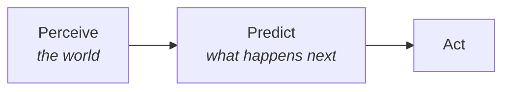

# Geologic Dome Context

> Everything on this page comes from the onboarding document. Do not add claims about the company,
> its robots, or its deployments from memory or from the web — if it is not in the PDF or verified
> elsewhere, it does not belong here.

## What the company does

Geologic Dome builds **edge infrastructure and robots for extreme and regulated environments**:
rainforests, high mountains, and remote conservation sites.

- **Autonomous field nodes** — solar power, a satellite link, and on-device AI.
- **Robots** — including **Pemba**, a **Unitree G1 humanoid**.
- In **June 2026, Pemba became the first humanoid robot to stand on Chimborazo at 6,263 m.**

## The idea this project sits inside

> The same AI that lets a robot understand and move through the world can help us watch over it and
> protect it.

Wildlife monitoring, prediction, and humanoid robotics are **one problem seen from three angles**:

This project sits at that intersection. It is why a camera-trap detection task is the on-ramp to
humanoid robotics rather than a detour from it — see [[Four Phase Arc]].

## Mentor and contact

- **Mentor:** Pabs
- **Email:** p@geologicdome.com
- **Also:** Robot Everest 2026 — roboteverest.com

Check-in expectations are in [[How We Work]]; the check-in notes live in `03 Check-ins/`.

## Why this matters beyond the code

The IUCN lists **every great ape species as Endangered or Critically Endangered**, and the PanAf
footage is real field data from conservation sites. The ethical constraints that follow — location
sensitivity, not overstating what a detector can do — are recorded in
[dataset docs](../docs/dataset.md) and [licensing](../docs/licensing.md).

Note the terminology the onboarding is explicit about: these are **great apes, not monkeys**.

## Related

[[Four Phase Arc]] · [[Phase 1 Task Spec]] · [[How We Work]] · [[PanAf Command Center]]
