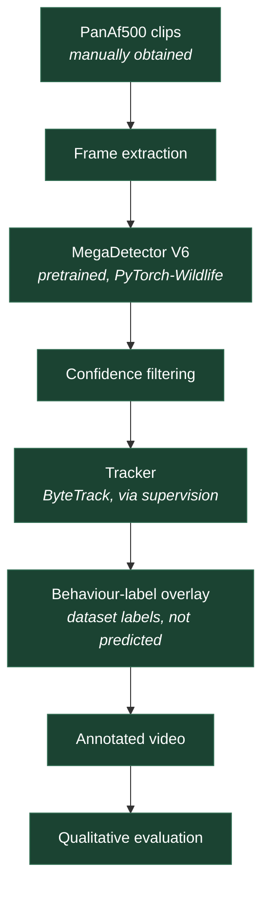

# panaf-ape-detection

Phase 1 ("See") of a wildlife computer-vision and robotics project: establish a reproducible
baseline for detecting great apes in wild camera-trap video by running the **pretrained
MegaDetector V6** detector, via **Microsoft PyTorch-Wildlife**, over a small hand-selected sample
of clips from the **PanAf500** subset of the PanAf20K dataset. No fine-tuning is performed. The
goal of this phase is to find out how a general-purpose animal detector behaves on this footage —
where it works, where it fails, and what a tracker and behaviour-label overlay would need to cope
with — and to record that honestly enough that someone else can reproduce it.

## Status

**Phase 1 pipeline complete and measured on the full sample.**

What works today: PanAf500 clip selection and download, frame decoding, pretrained MegaDetector V6
inference, confidence filtering, **ByteTrack tracking**, behaviour-label overlay, annotated video
export, and **accuracy and track quality measured against the dataset's ground-truth boxes and
`ape_id`**.

Measured on **all 500 PanAf500 clips / ~180,000 frames / 201,430 annotated boxes / 874 annotated
individuals** at IoU 0.50 — the entire densely-annotated subset, on a verified Colab A100:

| | Precision | Recall | F1 | Pooled mean IoU |
|---|---|---|---|---|
| Best single-frame threshold (0.40) | 0.864 | 0.808 | 0.835 | — |
| Pipeline before 2026-07-28 | 0.794 | 0.850 | 0.821 | 0.837 |
| **Pipeline as shipped** | **0.855** | **0.859** | **0.857** | 0.838 |

Tracking, over 874 individuals: **301 ID switches** (was 2257), fragmentation **1.27** (was 2.48),
identity coverage **0.823** (was 0.740), box jitter down **77%**.

The shipped pipeline is **more accurate than any confidence threshold can be**. It detects
generously at 0.05 — where raw precision is only 0.468 — and lets the tracker discard what does not
persist. Temporal consistency is evidence a per-frame threshold cannot use.

What still fails is **occlusion and scale**: `sitting_on_back` at 0.207 recall, the arboreal
postures at 0.60–0.73, and small subjects at 0.711 against 0.93 for medium and large. See
[the findings write-up](reports/phase1_findings_2026-07-28.md) for the full breakdown, including
what a third of the tracking gain turned out to be worth once it was tested on unseen clips.

No fine-tuning has been done; this phase exists to produce the evidence for that decision.

### The annotated clips

Three showcase clips are rendered from the shipped configuration by
`panaf-phase1 detect`, into `artifacts/showcase/videos/`. They are **not committed**: annotated
footage is a derived work of a non-commercially-licensed dataset, and this repository never
redistributes it. Reproducing them locally takes about ten minutes on an Apple MPS machine.

Green is the model's prediction with its track id; amber is the dataset's ground truth with its
behaviour label. MegaDetector only ever outputs `animal` — the behaviour comes from the dataset,
never from the model, and the legend is drawn on every frame so a still is unambiguous.

Current task, reading progress and the deliverable checklist are tracked in
[`docs/obsidian/00 Start Here/PanAf Command Center.md`](docs/obsidian/00%20Start%20Here/PanAf%20Command%20Center.md).

## Phase 1 research question

> Without any fine-tuning, how reliably does pretrained MegaDetector V6 localise great apes in
> PanAf500 camera-trap clips, and under which conditions does it fail?

Sub-questions that the phase should answer qualitatively:

- Which failure modes dominate: missed detections, false positives, or unstable boxes?
- Which recording conditions (darkness, occlusion, distance, motion blur, dense vegetation)
  correlate with failure?
- Are detections stable enough frame-to-frame for a simple tracker to maintain identities?
- Does the detector's `animal` class fire on the same subjects the dataset's behaviour labels
  describe?

## Scope and non-goals

**In scope**

- Selecting roughly 5–10 PanAf500 clips and recording that selection in a checksummed manifest.
- Running pretrained MegaDetector V6 inference frame by frame.
- Adding a simple tracker (ByteTrack or SORT) once detection is working.
- Overlaying the **dataset-provided** behaviour labels next to detections.
- Producing 2–3 annotated clips or GIFs.
- Keeping a research log and writing a one-page findings summary.

**Explicitly not in scope for Phase 1**

- Fine-tuning, transfer learning, or any training code.
- Species classification. MegaDetector predicts `animal` / `person` / `vehicle`; it does not
  distinguish chimpanzees from gorillas.
- Behaviour recognition. Behaviour labels are read from the dataset, never predicted.
- mAP (a threshold sweep). Accuracy **is** measured, but at one stated confidence and IoU
  threshold — the operating point actually run — rather than averaged across thresholds.
- Redistributing dataset files or model weights through this repository.
- Real-time or on-robot deployment.

## Pipeline



Every stage is implemented. Tracking was deliberately left until last, so the backend could be
chosen against measured detection behaviour rather than guessed at.

| Stage | Status | Where it lives |
| --- | --- | --- |
| Clip selection + manifest | **Done** | `scripts/fetch_panaf500.py`, `manifest.py` |
| Frame decoding | **Done** | `data/video.py` |
| MegaDetector V6 inference | **Done** | `inference/megadetector.py` |
| Confidence filtering | **Done** | `inference/filtering.py` |
| Tracking | **Done** (ByteTrack) | `tracking/bytetrack.py` |
| Behaviour-label overlay | **Done** | `visualization/overlays.py` |
| Video export | **Done** | `visualization/video.py` |
| Accuracy vs ground truth | **Done** | `evaluation/detection.py` |
| Track quality vs `ape_id` | **Done** | `evaluation/tracking.py` |

See [`docs/obsidian/05 Technical/architecture.md`](docs/obsidian/05%20Technical/architecture.md) for the intended module boundaries.

## Quick start

This project uses [uv](https://docs.astral.sh/uv/). Install it first:

```bash
curl -LsSf https://astral.sh/uv/install.sh | sh
```

### Developer setup (lightweight — no ML stack)

Enough to run the CLI, the tests and every quality check. Downloads no model weights and needs no
GPU. This is what CI installs.

```bash
git clone https://github.com/adikothuri3/PanAF-Ape-Detection.git
cd PanAF-Ape-Detection
uv sync
uv run panaf-phase1 doctor
uv run panaf-phase1 validate-config --config configs/base.yaml
uv run pytest
```

### Full inference setup (heavy)

Adds PyTorch, torchvision, PyTorch-Wildlife, OpenCV and supervision. This pulls in a large
dependency tree (PyTorch-Wildlife itself depends on `ultralytics`, `lightning` and `gradio`), so
expect a multi-gigabyte download.

```bash
uv sync --extra inference
uv run panaf-phase1 doctor    # should now report the inference stack as present
```

You also need **FFmpeg** on your `PATH` for video decoding and export:

```bash
brew install ffmpeg          # macOS
sudo apt-get install ffmpeg  # Debian/Ubuntu
```

`panaf-phase1 doctor` reports whether FFmpeg, CUDA and Apple MPS are available.

### Google Colab (the full 10-clip run)

Open [`notebooks/phase1_colab.ipynb`](notebooks/phase1_colab.ipynb) in Colab, then:

1. **Runtime → Change runtime type → GPU → Save** (A100 if available; T4 works) *(do this first — changing it later restarts
   the session)*
2. **Runtime → Run all**

Nothing to edit, nothing to upload. It clones the repo, installs, downloads the 10 clips from the
Bristol deposit, runs MegaDetector over every frame of all of them, and displays the annotated video
and metrics inline. About 15 minutes.

It uses [`configs/colab.yaml`](configs/colab.yaml) — `device: cuda`, all 10 clips, every frame.

> **The notebook deliberately does not install `requirements-colab.txt`.** That file pins the full
> locked environment including `torch`, and forcing it onto Colab replaces the CUDA-matched torch
> already there — a multi-gigabyte download that can leave the runtime without working CUDA. The
> notebook installs only what Colab lacks and keeps Colab's torch; `requirements-colab.txt` remains
> the source of truth for reproducing the environment outside Colab. Regenerate it with:
>
> ```bash
> uv export --extra inference --no-hashes --no-dev --format requirements-txt -o requirements-colab.txt
> ```

## Configuration

Configuration is YAML, loaded into a typed [pydantic](https://docs.pydantic.dev/) model in
[`src/panaf_ape_detection/config.py`](src/panaf_ape_detection/config.py).

- **Relative paths resolve against the repository root**, never the shell's working directory, so
  commands behave identically from any subdirectory, notebook or Colab checkout.
- **Unknown keys are a hard error.** A typo such as `confidance_threshold` fails loudly instead of
  being silently ignored.
- **Thresholds and counts are range-checked** — confidence in `[0, 1]`, strides and clip counts
  positive, frame rates positive and finite.
- **The MegaDetector variant is configuration, not a constant in code.** A run is only reproducible
  if the exact weights are recorded.
- **No secrets in YAML.** See [`.env.example`](.env.example).

Sections: `project`, `paths`, `data`, `model`, `tracking`, `video`, `logging`. Validate any file
with:

```bash
uv run panaf-phase1 validate-config --config configs/base.yaml
```

A small whitelist of environment variables may override operational settings — the knobs that
legitimately differ between a laptop, Colab and CI:

| Variable | Overrides |
| --- | --- |
| `PANAF_DEVICE` | `model.device` |
| `PANAF_MODEL_VARIANT` | `model.variant` |
| `PANAF_CONFIDENCE_THRESHOLD` | `model.confidence_threshold` |
| `PANAF_ARTIFACTS_DIR` | `paths.artifacts_dir` |
| `PANAF_MAX_CLIPS` | `data.max_clips` |
| `PANAF_LOG_LEVEL` | `logging.level` |
| `PANAF_EXPERIMENT_NAME` | `project.experiment_name` |
| `PANAF_REPO_ROOT` | repository-root discovery |

Anything scientifically meaningful should change in a versioned YAML file, so that it shows up in a
diff.

## Data

**No dataset files are included in this repository, and none may be committed to it.**

PanAf20K is the full dataset (~20,000 coarsely annotated camera-trap videos of chimpanzees and
gorillas from 14 African field sites); **PanAf500** is the smaller, densely annotated subset with
per-frame bounding boxes, tracks and behaviour labels. Phase 1 uses PanAf500 only, and only about
5–10 clips of it. Do not download the full dataset for this phase.

Obtain the data yourself from the University of Bristol deposit
(<https://data.bris.ac.uk/data/dataset/1h73erszj3ckn2qjwm4sqmr2wt>), place it under `data/raw/`,
treat that directory as immutable, and record your clip selection in a checksummed manifest:

```bash
cp data/sample_manifest.example.csv data/sample_manifest.csv
# fill in real clip ids, reasons for selection and SHA-256 checksums
```

Read [`data/README.md`](data/README.md) before touching any data. It covers the expected folder
layout, the manifest columns, checksum workflow, and the licensing constraints. There is
deliberately **no download script**: the acquisition process is documented rather than automated
until the exact endpoint and terms have been verified.

## Repository layout

**All documentation lives in the Obsidian vault at `docs/obsidian/`.** Open *that directory* with
*Open folder as vault* to browse it with backlinks and graph view; everything is plain Markdown and
reads fine without Obsidian.

```text
.
├── docs/obsidian/      The vault — all project documentation
│   ├── .obsidian/      Obsidian config (not notes; Obsidian does not index it)
│   ├── 00 Start Here/  PanAf Command Center — the entry point, start here
│   ├── 01 Onboarding/  Project context, four-phase arc, Phase 1 spec, working practice
│   ├── 02 Reading/     The onboarding reading list, one note per item
│   ├── 03 Check-ins/   Weekly check-in template and notes
│   ├── 04 Reference/   Glossary
│   └── 05 Technical/   Architecture, dataset, model, licensing, reproducibility
├── .github/            CI, Dependabot, issue and PR templates
├── .claude/            Claude Code hook and session skills
├── configs/            Versioned YAML configurations (base, colab)
├── data/               Dataset tree — contents git-ignored, README and example tracked
│   ├── raw/            Immutable, as-obtained dataset files
│   ├── interim/        Derived intermediates (extracted frames)
│   └── processed/      Analysis-ready derived data
├── experiments/        Running research log — the only one
├── notebooks/          Colab scaffold (no business logic)
├── reports/            Write-up template and figures
├── scripts/            Environment and repository checks
├── src/panaf_ape_detection/
│   ├── cli.py          Typer CLI (setup commands only)
│   ├── config.py       Typed YAML configuration
│   ├── paths.py        Repository-root discovery and layout
│   └── types.py        Detection / track / run-metadata schemas
├── tests/              Unit tests — no GPU, no weights, no network
└── artifacts/          Generated outputs — created on demand, entirely git-ignored
```

`README.md`, `CLAUDE.md`, `experiments/experiment_log.md` and
`reports/phase1_writeup_template.md` sit outside the numbered folders because tooling pins them
there — the wheel build, Claude Code, and `make verify` respectively — not because they are a second
documentation system. The small `README.md` files in `data/`, `notebooks/` and `experiments/` are
directory signposts, rendered by GitHub when you browse that folder.

**One fact, one home.** Anything else links to it rather than restating it.

Generated outputs go to `artifacts/`, which git ignores completely:

```text
artifacts/
├── detections/       Per-clip detection records
├── frames/           Extracted or rendered frames
├── metadata/         Run metadata (see docs/obsidian/05 Technical/reproducibility.md)
├── metrics/          Numerical summaries
├── videos/           Annotated clips and GIFs
└── visualizations/   Diagnostic plots and overlays
```

## Command-line workflow

Implemented today:

```bash
uv run panaf-phase1 doctor                                    # environment report
uv run panaf-phase1 validate-config --config configs/base.yaml
uv run panaf-phase1 show-paths                                # resolved layout
```

Planned, **not yet implemented** — these commands do not exist and `--help` will not list them:

```bash
panaf-phase1 extract-frames --config configs/base.yaml   # planned
panaf-phase1 detect         --config configs/base.yaml   # planned
panaf-phase1 track          --config configs/base.yaml   # planned
panaf-phase1 annotate       --config configs/base.yaml   # planned
```

They are absent rather than stubbed on purpose: a command that exists and does nothing is worse
than one that does not exist.

## Reproducibility policy

Summarised here, defined in full in [`docs/obsidian/05 Technical/reproducibility.md`](docs/obsidian/05%20Technical/reproducibility.md):

1. The environment is locked (`uv.lock`, committed) and the Python version is pinned
   (`.python-version`).
2. Raw data is immutable; nothing writes into `data/raw/`.
3. Clip selection lives in a checksummed CSV manifest.
4. Configuration is versioned YAML, not command-line ad-hockery.
5. Every run will record its git commit and whether the tree was dirty.
6. Seeds are set where they have an effect.
7. Every run will write a metadata record (schema: `RunMetadata` in `src/panaf_ape_detection/types.py`).
8. Hardware is documented alongside results.
9. Generated results are never hand-edited. If a number is wrong, the run is repeated.

GPU kernels are not always bit-wise deterministic, so identical inputs can still produce slightly
different scores across machines. The contract is that a run is *explicable and repeatable*, not
that it is bit-identical.

## Research logging

Every session that touches data or models gets an entry in
[`experiments/experiment_log.md`](experiments/experiment_log.md), appended newest-last, using the
template at the top of that file: objective, hypothesis, environment, clip ids, model and variant,
configuration, exact commands, observations, results, failures and dead ends, verbatim errors,
interpretation, next action.

Failures and dead ends are recorded, not deleted. A dead end that is written down is a result; one
that is silently dropped gets rediscovered later.

## Phase 1 deliverables

The three things that must exist at the end of Phase 1:

1. **A GitHub repo** — code plus a README.
2. **2–3 annotated clips or GIFs.**
3. **A one-page write-up** — what worked, what failed (missed detections, ID switches, dark frames),
   and three ideas to make it better.

> **Done means:** someone else can clone the repo, follow the README, and reproduce one annotated
> clip.

That acceptance test is stricter than "it runs on my machine", and it is the reason for the locked
environment, the checksummed manifest and the [reproducibility policy](#reproducibility-policy).

Working checklist:

- [x] 5–10 PanAf500 clips selected, justified and recorded in a checksummed manifest.
- [x] Frame extraction implemented and tested.
- [x] Pretrained MegaDetector V6 inference running over the sample.
- [x] A simple tracker integrated (ByteTrack), with the backend choice justified.
- [x] Dataset behaviour labels displayed beside detections, and compared against what is visible.
- [x] 2–3 annotated clips or GIFs in `artifacts/videos/` (generated locally; not committed).
- [x] A populated research log covering every run, including failures.
- [x] A one-page findings write-up from
      [`reports/phase1_writeup_template.md`](reports/phase1_writeup_template.md).

## Known limitations

- **MegaDetector is not an ape detector.** It is a general animal/person/vehicle detector; the
  `animal` class covers everything from a chimpanzee to a duiker. It cannot tell you which species,
  which individual, or what the animal is doing.
- **IoU is fixed at 0.50 and no mAP is claimed.** Confidence has been swept across 0.05–0.70 on the
  full dataset; IoU has not.
- **One corpus.** PanAf500 is 14 field sites and one camera-trap setup. Nothing here shows the
  settings transfer to other footage — and PanAf20K cannot extend it, because only this 500-clip
  subset carries the per-frame `ape_id` that tracking is scored against.
- **A third of the tracking gain was overfitting.** Settings tuned on 10 clips looked worth +11.1pp
  of identity coverage; on all 500 they were worth +7.6pp. The shipped settings were then re-chosen
  on the full dataset.
- **Track quality is measured with a small metric set** — ID switches, fragmentation and coverage
  against `ape_id`. MOTA and IDF1 are *not* implemented rather than half-implemented, because a
  metric nobody has hand-checked is not a measurement.
- **Colab sessions are ephemeral and time-limited**, which constrains how much footage can be
  processed in one pass.
- **Camera-trap footage is hard**: night-time infrared, heavy occlusion, small distant subjects and
  motion blur are all common and all expected to degrade detection.

## Roadmap

This project is **Phase 1 of a four-phase arc**. The phases run:

| Phase | Goal |
| --- | --- |
| **1 — See** | Detect and track great apes in wild camera-trap video and read their behaviour, using PanAf20K. **← this repository** |
| **2 — Pose** | Add a skeleton to each animal, turning movement into joint data — the same representation a robot uses. |
| **3 — Predict** | Build a small world model that predicts what the animal does next. |
| **4 — Embody** | Translate that movement onto a Unitree G1 humanoid in MuJoCo simulation with DimensionalOS (dimos). |

Phases 3 and 4 are open research problems — a full next-frame video model is hard, and mapping a
climbing, four-limbed ape onto a bipedal humanoid (*retargeting*) is harder. They are staged
deliberately. The job right now is Phase 1, done well.

Phase 1 breaks down as:

| Step | Goal | Status |
| --- | --- | --- |
| 1a | Repository scaffold, locked environment, config, CLI | **Done** |
| 1b | Clip selection + manifest; frame extraction | **Done** |
| 1c | Pretrained MegaDetector V6 inference + run metadata | **Done** |
| 1d | Tracker integration (ByteTrack, chosen from 1c evidence) | **Done** |
| 1e | Behaviour-label overlay + annotated clip export | **Done** |
| 1f | Quantitative + qualitative evaluation and write-up | In progress |
| — | **Stretch:** animal pose model (DeepLabCut or ViTPose) on one clip — the on-ramp to Phase 2 | Planned |

**Beyond Phase 1** — worth doing, but rigour *within* this phase rather than phases of the project:
a quantitative evaluation against PanAf500 ground truth, and a variant comparison before any
fine-tuning is considered.

## Citation and licensing

If this repository contributes to work you publish, cite the underlying dataset and models — not
this scaffold. Machine-readable metadata is in [`CITATION.cff`](CITATION.cff); BibTeX entries for
PanAf20K, the Bristol data deposit, MegaDetector and PyTorch-Wildlife are in
[`references.bib`](references.bib).

**Licensing is not a formality here.** Three separate licences apply and they are not the same one:

| Component | Licence |
| --- | --- |
| This repository's code | **Not yet selected** — no `LICENSE` file is present |
| PanAf20K / PanAf500 data | Set by the Bristol deposit; **non-commercial**. Verify before use |
| MegaDetector V6 weights | Varies **by variant** — the YOLOv9/YOLOv10 variants and the Apache RT-DETR variant differ |

Because no `LICENSE` file exists, default copyright applies to this code and no one has been
granted rights to reuse it. Read [`docs/obsidian/05 Technical/licensing.md`](docs/obsidian/05%20Technical/licensing.md) before publishing,
redistributing, or using any of this commercially.

## Acknowledgements

The PanAf20K dataset is the product of the Pan African Programme: The Cultured Chimpanzee, and of
the researchers and field sites credited in the dataset paper. MegaDetector and PyTorch-Wildlife
are developed and maintained by their respective teams; this project only runs them.
