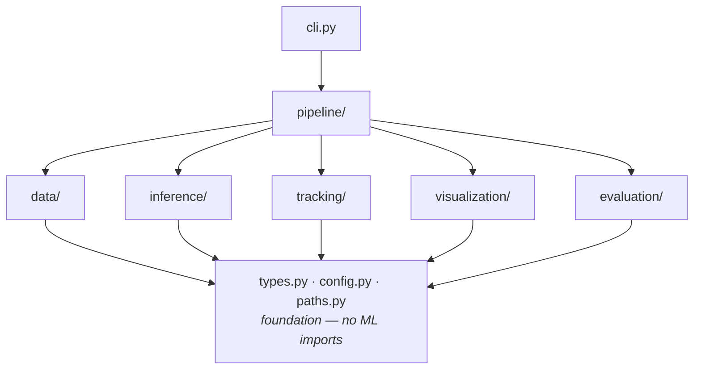

# Architecture

**Status: implemented.** The foundation — `config.py`, `paths.py`, `types.py`, `runtime.py`,
`provenance.py`, `manifest.py` and `cli.py` — and every stage module below (`data/`, `inference/`,
`tracking/`, `visualization/`, `evaluation/`, `pipeline/`) exists and is tested. The layout below is
what is on disk, not a plan.

## Two schema rules that are easy to get wrong

Both are enforced by `types.py` and covered by regression tests, because both failed silently before
they were caught:

1. **Tracked results use `TrackedFrameDetections`, never `FrameDetections`.** pydantic serializes to
   the *declared* field type. Storing `TrackedDetection` objects in a `FrameDetections`, whose field
   is `Sequence[Detection]`, keeps the subclass in memory but drops `track_id` and `behavior_label`
   on `model_dump()` — destroying the Phase 1d/1e deliverable the moment it is written to disk, with
   no error. The field is `Sequence`, not `list`, so the subclass override is type-safe and nothing
   can append an untracked detection into a tracked frame.
2. **Detection records carry frame dimensions.** Boxes are absolute pixels, so without
   `frame_width` / `frame_height` a saved record cannot be normalised, bounds-checked, or compared
   across resolutions without re-opening the video. `BoundingBox.relative_area()` is what makes
   "small distant subjects" — a failure axis named in [`model.md`](model.md) — measurable at all.

## Principle

Research code rots when the experiment logic, the model, and the plumbing become one thing. The
structure here exists to keep three questions answerable independently:

- *What data went in?* → `data/`
- *What model produced these boxes?* → `inference/`
- *How was it drawn?* → `visualization/`

If changing the tracker requires editing the video writer, the boundaries have failed.

## Intended modules

```text
src/panaf_ape_detection/
├── __init__.py         Lightweight namespace. No ML imports, ever.
├── paths.py            Repository-root discovery and the canonical layout.
├── types.py            Shared schemas: Detection, TrackedDetection, RunMetadata.
├── config.py           Typed YAML configuration.
├── manifest.py         Clip-manifest schema. Canonical column order; loading is
│                       Phase 1b.
├── runtime.py          Device resolution, seeding, and verifying where weights
│                       actually live. Lazy torch imports only.
├── provenance.py       Checksums, git state, dependency versions, and the one
│                       producer of RunMetadata.
├── cli.py              Typer entry point. Thin: parses, delegates, prints.
│
├── data/
│   ├── manifest.py     Load and validate the clip manifest; verify checksums.
│   ├── video.py        Decode clips, iterate frames, honour frame_stride.
│   └── annotations.py  Read dataset-provided behaviour labels and boxes.
│
├── inference/
│   ├── base.py         Detector protocol: frames in, Detection objects out.
│   ├── megadetector.py PyTorch-Wildlife MegaDetector V6 adapter.
│   └── filtering.py    Confidence thresholding and box post-processing.
│
├── tracking/
│   ├── base.py         Tracker protocol: Detection sequence -> TrackedDetection.
│   ├── convert.py      Detection <-> supervision.Detections, one place only.
│   └── bytetrack.py    ByteTrack adapter, plus drop_short_tracks.
│
├── visualization/
│   ├── overlays.py     Draw boxes, scores, track ids, behaviour labels.
│   └── video.py        Encode annotated clips and GIFs.
│
├── evaluation/
│   ├── detection.py    IoU matching, precision/recall/F1, by behaviour and size.
│   └── tracking.py     ID switches, fragmentation and coverage against ape_id.
│
└── pipeline/
    └── runner.py       Orchestration: wires stages together per config.
```

## The artifacts contract

Outputs are read by the notebook, by ad-hoc analysis and by future phases, so their layout is an
interface rather than an implementation detail:

| Path | Contents |
|---|---|
| `artifacts/detections/<clip>.json` | Per-frame detections, with `track_id` when tracking ran |
| `artifacts/metrics/<clip>.json` | Detection metrics — `overall`, `by_behaviour`, `by_size` |
| `artifacts/metrics/tracking/<clip>.json` | Track metrics — ID switches, fragmentation, coverage |
| `artifacts/metadata/<experiment>_<stamp>.json` | `RunMetadata`: commit, device, thresholds, checksums |
| `artifacts/videos/<clip>_annotated.mp4` | Annotated clip |

**One directory, one schema.** Detection and track metrics share `clip_id`, `frames_evaluated` and
`iou_threshold` — enough that a reader can mistake one for the other, and one did: they were
originally separated only by a `_tracking` filename suffix, and a notebook cell that globbed
`metrics/*.json` crashed on the first tracked run. Both payloads now carry a `schema` field, and
each lives in its own directory, so the mistake is not available to make.

`panaf_ape_detection.reporting` is the only supported reader. It is pure standard library, so it
works against a Drive copy with no repository around it, and it still reads the legacy layout.

## Dependency direction

Dependencies point one way. Nothing lower imports something higher.



Rules this encodes:

1. **The foundation imports nothing from the project.** `types.py`, `config.py` and `paths.py` are
   leaves. This is why they can be tested without a GPU and imported in a bare Colab runtime.
2. **Stage modules do not import each other.** `tracking/` never imports `inference/`; it consumes
   `Detection` objects from `types.py`. Swapping the detector cannot break the tracker.
3. **Only `pipeline/` knows the order of stages.** It is the one place that understands that
   detection precedes tracking.
4. **`cli.py` stays thin.** It parses arguments, loads config, calls one pipeline function, and
   formats output. No experiment logic lives in the CLI, and none lives in a notebook.
5. **Heavy imports are lazy.** `import torch` happens inside a function in `inference/`, never at
   module scope in a package that the CLI imports eagerly. This is what makes
   `panaf-phase1 doctor` work after a bare `uv sync`, and it is enforced by
   `scripts/verify_repository.py`.

## Why stages are separated

| Boundary | What it buys |
| --- | --- |
| `data/` vs `inference/` | Frame extraction is expensive and deterministic; detection is expensive and model-dependent. Separating them lets frames be cached in `data/interim/` and reused across every threshold and variant sweep. |
| `inference/` vs `tracking/` | The tracker consumes a generic `Detection`. ByteTrack can be swapped for SORT, or the detector for a fine-tuned one, without either knowing about the other. |
| `tracking/` vs `visualization/` | Drawing is a presentation concern. A bug in the overlay must never be able to change a recorded detection. |
| `visualization/` vs `evaluation/` | Judgements about failure cases are data, not pixels. Evaluation reads detection records, not rendered video. |
| everything vs `pipeline/` | Stage code stays unit-testable in isolation; orchestration is the only part that needs an end-to-end fixture. |

## Why model and tracker are configuration-driven

The MegaDetector variant and the tracker backend are fields in `configs/*.yaml`, resolved through
`ModelConfig` and `TrackingConfig`. They are deliberately **not** constants in application code.

1. **A result without its exact variant is not a result.** `MDV6-yolov9-c` and `MDV6-yolov10-e` are
   different models with different speed/accuracy trade-offs. "MegaDetector V6 found 82% of apes"
   means nothing without saying which one. `RunMetadata` records the variant with every run.
2. **Comparing variants must not require a code change.** Phase 3 anticipates a variant sweep. If
   the variant lives in code, each comparison is a diff; if it lives in config, each comparison is
   a file that can be committed alongside its results.
3. **Upstream defaults are not trustworthy.** Verified against the installed PyTorch-Wildlife
   1.3.0: `MegaDetectorV6.__init__` defaults to `version='yolov9c'`, and `MegaDetectorV6Apache`
   to `version='MDV6-rtdetr-x-apache'` — **neither string is accepted by that same method's own
   validation**, so relying on the default raises `ValueError`. An explicit, configured variant is
   not pedantry here; it is the only thing that works.
4. **Licensing differs by variant.** The YOLOv9/YOLOv10-derived weights and the Apache RT-DETR
   weights do not carry the same terms. A variant buried in code is a licence obligation nobody can
   audit. See [`licensing.md`](licensing.md).

The tracker backend is configuration for the same reason. `TrackingBackend` enumerates `none`,
`bytetrack` and `sort`; **`bytetrack` is implemented and is the default**, chosen from Phase 1c
evidence rather than guessed. `sort` remains a valid config value with no implementation behind it,
and `build_tracker` raises for it — running untracked while the config says otherwise would be worse
than failing.

## Adding deployment adapters later

This phase is offline batch research. Later phases may need live inference on a robot. The
separation above is what makes that an addition rather than a rewrite:

- **The detector protocol is the seam.** `inference/base.py` defines frames in, `Detection` out.
  A `TensorRTMegaDetector` or an ONNX Runtime adapter implements the same protocol and drops into
  the same config field. Research code never learns it changed.
- **`data/` is the input seam.** A camera source that yields frames satisfies the same iterator
  contract as a decoded file. `pipeline/` does not care which it got.
- **Presentation is already separate.** A deployment target that streams boxes over a socket
  instead of writing MP4 files replaces `visualization/`, and touches nothing else.
- **Config is already the switchboard.** Deployment settings become new sections validated the same
  strict way, rather than environment-variable sprawl.

The rule to preserve: **deployment concerns must not leak into stage modules.** No `if deployed:`
branches in `inference/megadetector.py`. If a deployment need cannot be expressed as a new adapter
behind an existing protocol, the protocol is wrong and should be changed deliberately.

## Testing strategy

- Foundation modules: pure unit tests, no fixtures. Already at high coverage.
- `data/`: tested against small synthetic videos generated in the test, never against real
  PanAf clips — the suite must run in CI with no dataset present.
- `inference/`: the adapter is tested with a stub detector satisfying the protocol. **Tests never
  download weights.** A real-weights test, if ever added, is marked and excluded from default CI.
- `tracking/`, `visualization/`: tested on synthetic `Detection` sequences with known answers.
- `pipeline/`: one end-to-end test with a stub detector and a two-frame synthetic clip.

## Tracking module layout

`tracking/` gained two modules during the tracking work, both obeying the rule that stage modules
import nothing from each other:

- `tracking/refine.py` — pure functions over `{frame_index: tracked detections}`: `stitch_tracks`,
  `interpolate_gaps`, `smooth_tracks`, and `refine` which applies them in the one sound order. No
  video, no detector, no ground truth.
- `pipeline/retrack.py` — offline re-tracking and sweeping over `artifacts/detections/`. It lives in
  `pipeline/` rather than `tracking/` because it spans stages (tracking **and** evaluation), and
  only `pipeline/` is allowed to know the stage order.

`panaf-phase1 track-sweep` writes a **third** artifact shape, so it gets a third directory rather
than a fourth filename convention: `artifacts/metrics/tracking-sweep/<name>.json`, schema
`panaf.tracking-sweep/v1`. One file per sweep, holding many arms — neither detection metrics nor
per-clip track metrics.

`TrackedDetection` carries an `interpolated` flag. Boxes synthesised to bridge a detector gap are
predictions, not measurements, and anything consuming tracks downstream — Phase 2 pose above all —
must be able to tell them apart. See [[tracking]].

## Related

- [[tracking]] — what the tracking stage measures, and what constrains it
- [[model]] — the detector behind `inference/`
- [[dataset]] — what the annotations contain
